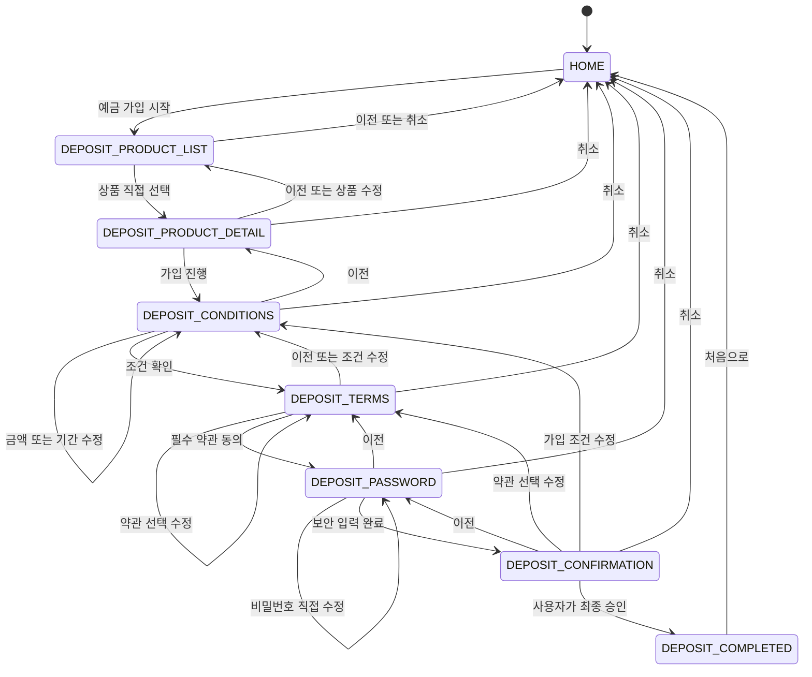
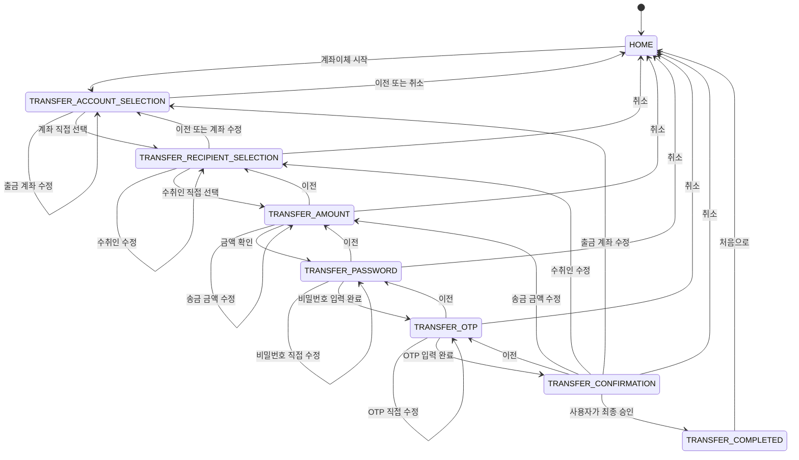
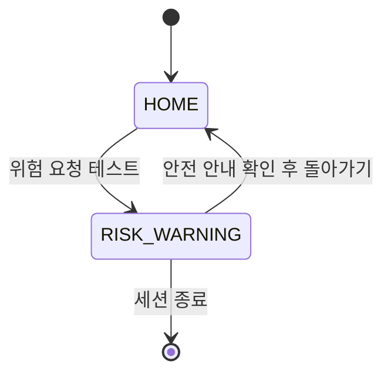

# 데모 금융사이트 화면 흐름

## 1. 문서 목적

이 문서는 실제 금융사이트와 분리된 시연용 자체 데모사이트의 화면 흐름과 사용자 책임 범위를 정의한다. 데모는 금융 자동화의 안전한 중단 지점과 사용자 직접 선택 과정을 재현하기 위한 것이며 실제 금융 거래를 처리하지 않는다.

## 2. 공통 원칙

- 사용자는 상품, 약관, 계좌, 수취인과 최종 승인을 직접 선택한다.
- 비밀번호와 OTP는 사용자가 해당 보안 입력 화면에서 직접 입력한다.
- AI는 일반 화면 이동과 민감하지 않은 일반 값 입력만 수행한다.
- 최종 승인 전에는 예금 가입이나 송금을 완료하지 않는다.
- 약관 전체 동의, 상품 자동 선택, 계좌 자동 선택과 최종 승인 자동 처리를 금지한다.
- 비밀번호, OTP와 계좌번호 원문은 화면 상태, DOM 속성, 자동화 데이터와 로그에 복사하지 않는다.
- 취소 시 입력 중인 민감정보를 폐기하고 `HOME`으로 돌아간다.

## 3. 메인 화면

`HOME`은 다음 시연 흐름의 시작점이다.

- 예금 가입 시작 영역
- 계좌이체 시작 영역
- `RISK_WARNING`으로 이동하는 위험 요청 테스트 진입점

메인 화면은 실제 금융상품 판매 페이지가 아니라 각 데모 흐름으로 진입하기 위한 안내 화면이다.

## 4. 예금 가입 흐름

예금 완료 화면은 사용자가 `DEPOSIT_CONFIRMATION`에서 최종 승인 체크와 승인 버튼을 직접 수행한 경우에만 진입한다.

## 5. 계좌이체 흐름

송금 완료 화면은 사용자가 `TRANSFER_CONFIRMATION`에서 수취인과 금액을 다시 확인하고 최종 승인한 경우에만 진입한다.

## 6. 위험 요청 흐름

`RISK_WARNING`에서는 송금, 이체, 예금 가입, 승인 등 금융 실행 버튼을 표시하지 않는다. 사용자는 홈으로 돌아가거나 세션을 종료할 수 있다.

## 7. 화면별 정보

| 화면 ID | 화면 이름 | 사용 목적 | 주요 표시 정보 | 사용자 입력 | 주요 버튼 | 다음 화면 | 보안 주의사항 |
| --- | --- | --- | --- | --- | --- | --- | --- |
| `HOME` | 메인 | 데모 업무 선택 | 서비스 설명, 예금·이체 진입점, 위험 테스트 | 업무 선택 | 예금 시작, 이체 시작, 위험 테스트 | `DEPOSIT_PRODUCT_LIST`, `TRANSFER_ACCOUNT_SELECTION`, `RISK_WARNING` | 실제 금융사이트로 오해할 표현 금지 |
| `RISK_WARNING` | 위험 경고 | 위험 요청 차단과 안전 안내 | 자동화 중단, 공식 연락처 확인 안내 | 홈 복귀 또는 종료 선택 | 홈으로, 세션 종료 | `HOME` 또는 세션 종료 | 금융 실행 버튼 표시 금지 |
| `DEPOSIT_PRODUCT_LIST` | 예금 상품 목록 | 가입할 상품 후보 확인 | 상품명, 기간, 금리 예시 | 상품 직접 선택 | 상품 선택, 이전, 취소 | `DEPOSIT_PRODUCT_DETAIL`, `HOME` | AI 자동 선택 금지 |
| `DEPOSIT_PRODUCT_DETAIL` | 예금 상품 상세 | 선택 상품 조건 확인 | 상품 설명, 기간, 금리, 유의사항 | 진행 여부 | 이전, 가입 진행, 취소 | `DEPOSIT_PRODUCT_LIST`, `DEPOSIT_CONDITIONS`, `HOME` | 수익 보장 표현 금지 |
| `DEPOSIT_CONDITIONS` | 예금 가입 조건 | 금액과 기간 설정 | 선택 상품, 가능 기간, 금액 범위 | 가입 금액, 기간 | 이전, 다음, 취소 | `DEPOSIT_PRODUCT_DETAIL`, `DEPOSIT_TERMS`, `HOME` | 일반 값만 상태에 저장 |
| `DEPOSIT_TERMS` | 예금 약관 | 필수·선택 약관 개별 동의 | 필수 약관, 선택 약관, 동의 상태 | 약관별 체크 | 이전, 다음, 취소 | `DEPOSIT_CONDITIONS`, `DEPOSIT_PASSWORD`, `HOME` | 전체 동의 자동 처리 금지 |
| `DEPOSIT_PASSWORD` | 예금 비밀번호 입력 | 사용자 본인 확인 입력 | 보호 모드, AI·캡처 중단 상태 | 계좌 비밀번호 직접 입력 | 이전, 입력 완료, 취소 | `DEPOSIT_TERMS`, `DEPOSIT_CONFIRMATION`, `HOME` | 실제 값의 상태·DOM 속성·로그 복사 금지 |
| `DEPOSIT_CONFIRMATION` | 예금 최종 확인 | 가입 내용 검토와 최종 승인 | 상품, 기간, 금액, 약관 결과 | 최종 승인 체크 | 이전, 수정, 최종 승인, 취소 | `DEPOSIT_PASSWORD`, 수정 대상 화면, `DEPOSIT_COMPLETED`, `HOME` | 승인 전 가입 완료 금지 |
| `DEPOSIT_COMPLETED` | 예금 가입 완료 | 시연 결과 확인 | 처리 결과 요약 | 없음 | 처음으로 | `HOME` | 비밀번호와 계좌번호 원문 표시 금지 |
| `TRANSFER_ACCOUNT_SELECTION` | 출금 계좌 선택 | 출금 계좌 후보 확인 | 계좌 별칭, 마스킹 번호, 잔액 예시 | 계좌 직접 선택 | 계좌 선택, 이전, 취소 | `TRANSFER_RECIPIENT_SELECTION`, `HOME` | 계좌번호는 마스킹된 값만 표시 |
| `TRANSFER_RECIPIENT_SELECTION` | 수취인 선택 | 송금 대상 확인 | 수취인 이름, 등록 정보 | 수취인 직접 선택 | 이전, 다음, 취소 | `TRANSFER_ACCOUNT_SELECTION`, `TRANSFER_AMOUNT`, `HOME` | AI 자동 선택 금지 |
| `TRANSFER_AMOUNT` | 송금 금액 | 송금 금액 입력과 검토 | 출금 계좌 별칭, 수취인, 금액 안내 | 송금 금액 | 이전, 다음, 취소 | `TRANSFER_RECIPIENT_SELECTION`, `TRANSFER_PASSWORD`, `HOME` | 금액 오류와 한도 안내 필요 |
| `TRANSFER_PASSWORD` | 이체 비밀번호 입력 | 사용자 본인 확인 입력 | 보호 모드, AI·캡처 중단 상태 | 계좌 비밀번호 직접 입력 | 이전, 입력 완료, 취소 | `TRANSFER_AMOUNT`, `TRANSFER_OTP`, `HOME` | 실제 값의 상태·DOM 속성·로그 복사 금지 |
| `TRANSFER_OTP` | OTP 입력 | 추가 본인 확인 입력 | 보호 모드, AI·캡처 중단 상태 | OTP 직접 입력 | 이전, 입력 완료, 취소 | `TRANSFER_PASSWORD`, `TRANSFER_CONFIRMATION`, `HOME` | OTP 원문 저장·출력 금지 |
| `TRANSFER_CONFIRMATION` | 송금 최종 확인 | 송금 내용 검토와 최종 승인 | 거래 유형, 계좌 별칭, 수취인, 금액 | 최종 승인 체크 | 이전, 수정, 최종 승인, 취소 | `TRANSFER_OTP`, 수정 대상 화면, `TRANSFER_COMPLETED`, `HOME` | 승인 전 송금 완료 금지 |
| `TRANSFER_COMPLETED` | 송금 완료 | 시연 결과 확인 | 처리 결과 요약 | 없음 | 처음으로 | `HOME` | OTP와 계좌번호 원문 표시 금지 |

## 8. D1 완료 체크리스트

- [x] 예금 전체 화면 흐름 존재
- [x] 계좌이체 전체 화면 흐름 존재
- [x] 위험 경고 흐름 존재
- [x] 모든 예정 화면의 URL 정의
- [x] D3 구현 URL 구분
- [x] 요소 ID 접두사 규칙 정의
- [x] Playwright용 고정 ID 예시 정의
- [x] 민감정보 DOM 처리 원칙 정의
