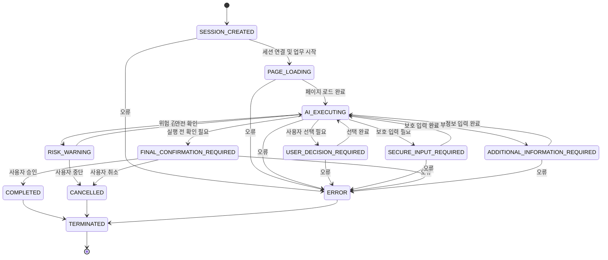

# 프론트 화면 상태 구성

## 1. 좌표 체계

- 기준 해상도는 **1280 x 720**이다.
- 좌표 원점은 화면 왼쪽 위의 **(0, 0)**이다.
- X 좌표는 오른쪽으로 갈수록 증가한다.
- Y 좌표는 아래쪽으로 갈수록 증가한다.

## 2. 상태 모델

`WorkflowStatus`와 `ScreenType`은 서로 다른 개념이다.

- `WorkflowStatus`: 백엔드와 프론트가 공통으로 사용하는 전체 업무 상태
- `ScreenType`: 프론트가 실제로 표시할 세부 화면 종류

하나의 `WorkflowStatus`에서 업무 맥락에 따라 여러 `ScreenType`을 표시할 수
있다. 프론트는 백엔드가 전달한 전체 업무 상태를 임의로 바꾸지 않고, 해당
상태와 업무 데이터에 맞는 세부 화면을 선택한다.

### WorkflowStatus 목록

| 값 | 의미 |
| --- | --- |
| `SESSION_CREATED` | 업무 세션이 생성됐거나 최초 화면에서 세션 시작을 준비하는 상태 |
| `PAGE_LOADING` | 대상 금융 페이지를 불러오는 상태 |
| `AI_EXECUTING` | AI가 화면을 분석하거나 다음 작업을 수행하는 상태 |
| `USER_DECISION_REQUIRED` | 상품, 계좌, 수취인 또는 약관에 대한 사용자 선택이 필요한 상태 |
| `SECURE_INPUT_REQUIRED` | 비밀번호, OTP 등 보호 입력이 필요한 상태 |
| `FINAL_CONFIRMATION_REQUIRED` | 예금 또는 이체 실행 전 최종 확인이 필요한 상태 |
| `ADDITIONAL_INFORMATION_REQUIRED` | 업무 진행에 필요한 추가 정보를 사용자에게 요청하는 상태 |
| `RISK_WARNING` | 보이스피싱 등 위험을 감지해 경고하는 상태 |
| `COMPLETED` | 업무가 정상적으로 완료된 상태 |
| `CANCELLED` | 사용자가 업무를 취소한 상태 |
| `ERROR` | 복구 또는 안내가 필요한 오류가 발생한 상태 |
| `TERMINATED` | 세션과 업무 흐름이 종료된 상태 |

### WorkflowStatus와 ScreenType 연결

| WorkflowStatus | 표시 가능한 ScreenType |
| --- | --- |
| `SESSION_CREATED` | `INITIAL_SCREEN`, `SESSION_READY` |
| `PAGE_LOADING` | `BROWSER_LOADING` |
| `AI_EXECUTING` | `AI_PROGRESS` |
| `USER_DECISION_REQUIRED` | `PRODUCT_SELECTION`, `ACCOUNT_SELECTION`, `RECIPIENT_SELECTION`, `TERMS_AGREEMENT` |
| `SECURE_INPUT_REQUIRED` | `ACCOUNT_PASSWORD`, `OTP_INPUT`, `CERTIFICATE_PASSWORD` |
| `FINAL_CONFIRMATION_REQUIRED` | `DEPOSIT_CONFIRMATION`, `TRANSFER_CONFIRMATION` |
| `ADDITIONAL_INFORMATION_REQUIRED` | `USER_QUESTION` |
| `RISK_WARNING` | `VOICE_PHISHING_WARNING` |
| `COMPLETED` | `WORKFLOW_COMPLETED` |
| `CANCELLED` | `WORKFLOW_CANCELLED` |
| `ERROR` | `WORKFLOW_ERROR` |
| `TERMINATED` | `INITIAL_SCREEN` |

## 3. 화면 상태 구성도

## 4. 프론트 상태 객체의 역할

`FrontendScreenState`는 현재 세션과 화면을 렌더링하는 데 필요한 최소 상태를
한곳에 모은다.

| 필드 | 역할 |
| --- | --- |
| `sessionId` | 백엔드 세션 식별자. 세션이 확정되기 전에는 `null`이다. |
| `workflowStatus` | 백엔드와 공유하는 전체 업무 상태 |
| `screenType` | 프론트가 현재 표시할 세부 화면 |
| `message` | 진행 상황, 질문, 경고 또는 오류를 사용자에게 설명하는 문구 |
| `isConnected` | 백엔드 세션 연결 여부 |
| `isLoading` | 현재 화면에서 비동기 처리가 진행 중인지 여부 |

초기 상태는 세션 식별자가 아직 없는 최초 화면을 나타낸다. 따라서
`sessionId`는 `null`, `workflowStatus`는 `SESSION_CREATED`, `screenType`은
`INITIAL_SCREEN`이며 연결 및 로딩 값은 모두 `false`이다.

## 5. 화면 전환 및 보안 원칙

- 화면 전환은 `WorkflowStatus`와 현재 업무 데이터에 따라 결정한다.
- 프론트는 백엔드에서 수신한 `WorkflowStatus`를 임의로 추정하거나 건너뛰지 않는다.
- 동일한 `WorkflowStatus` 안의 세부 화면 전환은 `ScreenType`으로 표현한다.
- 비밀번호, OTP, 인증서 비밀번호 등 보안 입력값은 프론트 상태 객체에 저장하지 않는다.
- 보안 입력은 로그, 분석 이벤트, 화면 메시지 또는 네트워크 재전송 데이터에 남기지 않는다.
- `SECURE_INPUT_REQUIRED`에서는 일반 자동 입력과 화면 캡처를 중단하고 사용자가 직접 입력하게 한다.
- `FINAL_CONFIRMATION_REQUIRED`에서는 금액, 대상 계좌와 수취인 등 핵심 정보를 다시 표시하고 명시적 승인을 받는다.
- `RISK_WARNING`에서는 자동 실행을 중단하고 경고에 대한 사용자의 판단을 우선한다.
- `ERROR`, `CANCELLED`, `COMPLETED` 이후에는 종료 절차를 거쳐 세션 데이터와 민감한 화면 정보를 정리한다.
